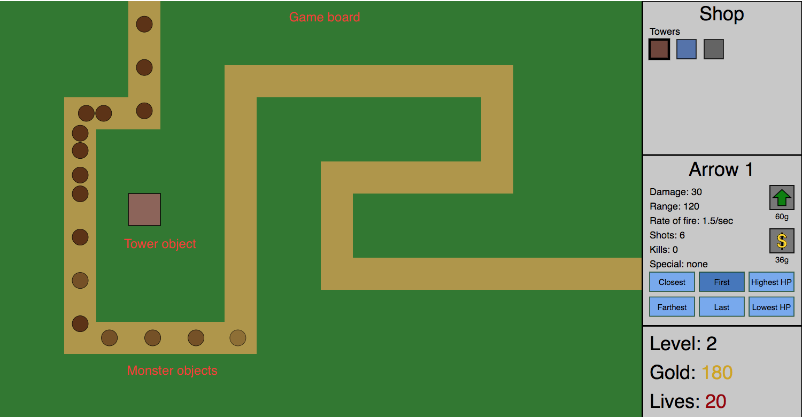

## BugDefense
Live link: 

### Background
Tower defense games are a common genre of game that generally involves building towers that fire at enemies and stop them before they get to your base. Towers are upgradable, and enemies become progressively stronger as the player progresses.

Back in early 2015, I made a [tower defense game][aws] using jQuery and SVG. Although the game is playable in its current state, I would like to apply the skills I have learned at App Academy to truly make it stand out.

Specifically:
- Modularize the code to make it more readable and robust. Currently, all code is in one huge HTML/Javascript file.
- Implement an object-oriented model for towers, bullets, and monsters.
- Make the game look better.
- Add more features - more towers, different types of monsters, etc.

[aws]: http://tower-defense.s3-website-us-west-1.amazonaws.com/

### Functionality & MVP  

With this tower defense game, users will be able to:

- [ ] Start/pause the game and reset when game over
- [ ] Place towers with different abilities and appearances
- [ ] Upgrade towers and customize their behavior
- [ ] Spawn enemy monster waves with different characteristics

In addition, this project will include:

- [ ] A production readme
- [ ] SVG images for towers, bullets, and monsters

### Wireframes

This app will consist of a single screen. The main game screen will have the game board on the left and the shop and information on the right. The shop is where players will buy and upgrade towers. Information includes the current level, gold, and number of lives. Below the main game screen will be links to my Github and Linkedin.

The user will control the game through the mouse or keyboard. Every mouse command will have a keyboard shortcut and vice-versa.

### Architecture and Technologies

This project will be implemented with the following technologies:

- Vanilla JavaScript and jQuery for overall structure and game logic,
- SVG and CSS for rendering visual elements,
- Webpack to bundle and serve up the various scripts.

In addition to the webpack entry file, there will be three scripts involved in this project:

`game.js`: This script will handle the game logic and render the relevant visual elements.

`monster.js`: This script will define `Monster` objects. The main properties will be `hp`, `speed`, `pos`, and `icon`. `icon` is the SVG image that will be used to represent the `Monster` instance.

`tower.js`: This script will define `Tower` objects. The main properties will be `bullet`, `fireRate`, `icon`, and `pos`. `findTarget` will identify the target that the tower will fire towards.

`bullet.js`: This script will define `Bullet` objects. The main properties will be `damage`, `pos`, and `icon`. `onHit()` will define what happens when bullets hit their targets.

### Implementation Timeline

**Day 1**: Setup all necessary Node modules, including getting webpack up and running. Create `webpack.config.js` as well as `package.json`. Write a basic entry file. Create constructors, properties, and methods for the three classes. Goals for the day:

- Get a green bundle with `webpack`
- Create object-oriented framework for Monsters, Towers, and Bullets

**Day 2**: Dedicate this day to refactoring old code. Split the old code between the four new `.js` files and minimize/eliminate any duplicate code. Goals for the day:

- Split old Javascript code into the four new files
- Identify what code is repetitive and make it more DRY
- Ensure that the game remains functional

**Day 3**: Half the day will be continuing the refactoring work from Day 2. The other half will be spent on making the game more visually appealing. Goals for the day:

- Finalize object-oriented structure, ensuring that it is as DRY as possible
- Have custom SVG models for bullets and monsters

**Day 4**: Continue making the game more visually appealing. Specifically, try to incorporate animations into this (e.g. bullet impact, tower firing).

- Have custom SVG model for towers
- Have animations for bullet impact and tower firing

### Bonus features

Some potential future directions:

- [ ] Add sound (that is mutable)
- [ ] Save high scores
- [ ] Add towers that fire things other than bullets (for example, light beams)
